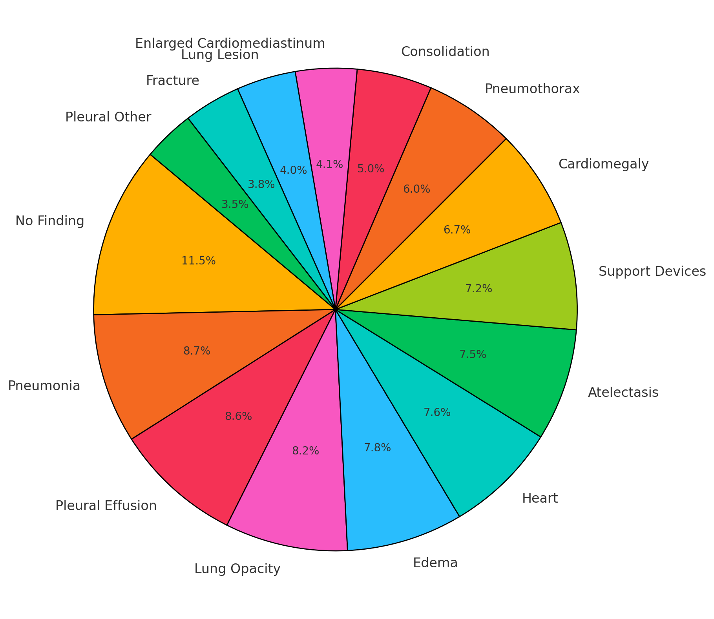

# MIMIC-CXR-VQA — Official Code Repository

This repository contains the **official implementation** of the creation code of the dataset MIMIC-CXR-VQA.

📄 **Paper:** *MIMIC-CXR-VQA: A Medical Visual Question Answering Dataset Constructed with LLaMA-based Annotations*

🔗 **Link:** [Comming Soon!!]

-----

## Dataset

## 🤖 Baselines

- **Baseline 1:** [SwinVED-SCST](https://github.com/Maa1604/SwinVED-SCST)
- **Baseline 2:** [BLIP-2 MultiView](https://github.com/Maa1604/BLIP-2-MultiView)
